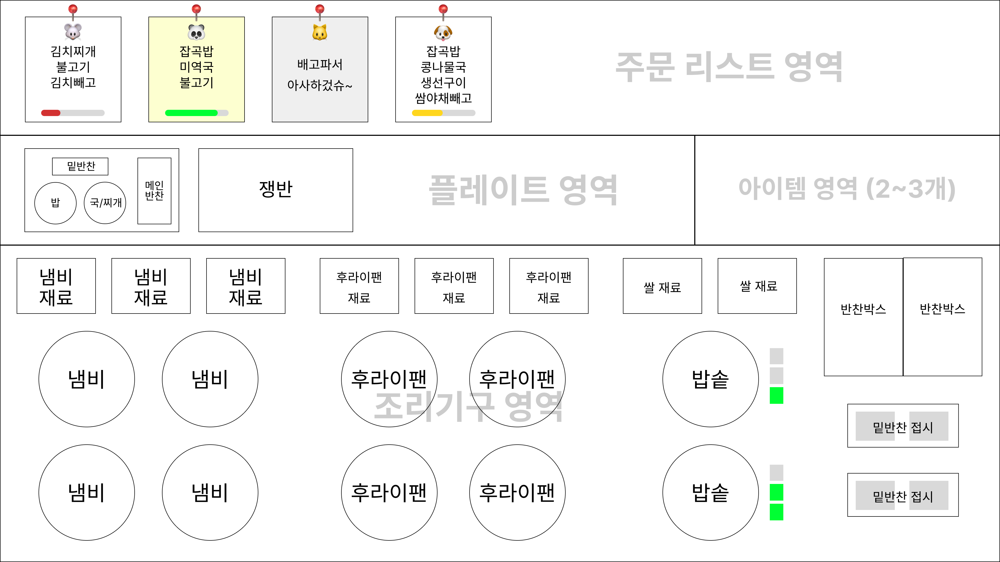
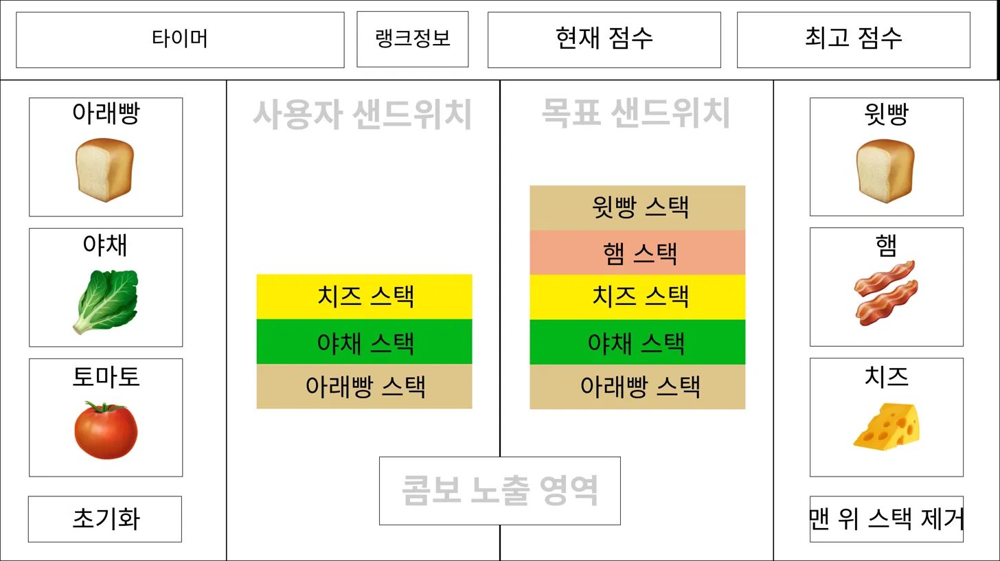

# GDD — 메인 게임 설계

> 문서: GDD_game.md
> 버전: v0.3
> 작성: ciny + Claude (기획 에이전트)
> 최초 작성일: 2026-05-21

---

## 1. 메인 게임 개요

### 1.1 기본 흐름

```
주문서 등록 + 인내심 타이머 시작
→ 재료 드래그앤드롭 → 조리 시작 → 조리 완료
→ 완성 음식 쟁반에 셋팅 → 주문서 탭 → 서빙 완료 → 쟁반 초기화 → 골드 획득
```

### 1.2 게임 화면 레이아웃

와이어프레임 참고:



```
┌─────────────────────────────────────────────────────────┐
│                   주문 리스트 영역                        │
├──────────────────────────────────┬──────────────────────┤
│   플레이트 영역                   │   아이템 영역          │
│   (쟁반 1행 n열 배치)             │   (장치형 / 1회성)     │
├──────────────────────────────────┴──────────────────────┤
│   조리기구 영역                                           │
│   냄비 | 프라이팬 | 밥솥 | 반찬통                         │
└─────────────────────────────────────────────────────────┘
```

---

## 2. 주문 리스트 영역

### 2.1 기본 규칙

- 주문서는 들어온 순서대로 좌→우 정렬
- 최대 10건까지 등록 가능, 영역이 가득 차면 신규 주문 중단
- 진행 날짜(레벨)에 따라 주문 등록 간격 및 최대 건수 조정 (레벨 디자인 시 수치 확정)
- 특별 손님 주문서는 별도 색상으로 표기

### 2.2 주문서 구성

**손님 아이콘**

| 구분 | 동물 종류 | 중복 방문 |
|------|-----------|----------|
| 일반 손님 | 쥐, 참새, 강아지, 고양이 | 가능 |
| 특별 손님 | 호랑이, 토끼, 여우, 곰, 너구리, 판다 | 불가 |

**메뉴 구성**

| 카테고리 | 종류              | 필수 여부                                | 접시모양                    |
| ---- | --------------- | ------------------------------------ | ----------------------- |
| 밥류   | 쌀밥, 잡곡밥         | 필수 (없을 경우 쌀밥으로 자동 처리)                | 동그라미                    |
| 메인반찬 | 불고기, 생선구이, 닭갈비  | 필수 (1개 이상)                           | 높이가 긴 직사각형              |
| 국/찌개 | 김치찌개, 미역국, 콩나물국 | 옵션                                   | 동그라미                    |
| 서브반찬 | 배추김치, 쌈채소       | 옵션 — 지정 없으면 기본 2종 제공, 지정 시 해당 반찬만 제공 | 1x2의 정사각형으로 분할되어있는 직사각형 |

**타이머**

- 잔여 시간에 따라 색상 변경: 초록 → 노랑 → 빨강
- 타이머 소진 시: 손님 화남 대사 오버랩 → 주문서 사라짐

### 2.3 서빙 처리

- 주문서 탭 → 해당 주문과 매칭되는 쟁반 자동 확인
- 쟁반에 주문 메뉴가 모두 셋팅되어 있을 경우 서빙 완료 → 쟁반 초기화
- 쟁반에 메뉴가 부족할 경우 서빙 불가

---

## 3. 플레이트 영역

- 쟁반을 1행 n열로 배치
- 기본 쟁반 1개 제공, 창고 메뉴에서 추가 가능
- 각 쟁반 슬롯: 밥 / 메인반찬 / 국찌개 / 서브반찬 4칸
- 같은 카테고리 음식은 중복 셋팅 불가 (드래그 전 상태로 초기화)
- 완성된 음식 드래그앤드롭으로 쟁반에 셋팅

---

## 4. 아이템 영역

- 장치형 아이템: 게임 전체 유지, 상점에서만 구매, 장식품 개념
- 1회성 아이템: 1회 주문건에만 적용, 인게임 + 아이콘으로 골드 소모 구매 가능
- 상세 아이템 종류 및 수치: 추후 결정 예정

| 종류 | 예시 효과 |
|------|----------|
| 1회성 | 손님 인내심 타이머 초기화, n초간 즉시 조리 완료 |
| 장치형 | 장식품 (효과 추후 결정) |

---

## 5. 조리기구 영역

> 추가 및 업그레이드는 창고 메뉴에서만 가능 (인게임 중 불가)
> 2초 이상 클릭 시 해당 조리기구 초기화 (음식 비움)
> 조리 시작 후 상호작용 불가, 업그레이드 상태/아이템에 따라 조리 시간 결정
> 조리 완성 순간 탄 음식 카운트다운 타이머 시작 (0이 되면 탄 음식 처리, 사용 불가)

### 5.1 냄비 — 국/찌개류

- 기본 제공: 냄비 1개, 재료박스 1개
- 최대: 냄비 4개, 재료박스 3개
- 업그레이드: 냄비 → 조리 속도 증가 / 재료박스 → 골드 수급량 증가
- 1회 조리 시 1인분 생성

| 재료 | 완성 음식 |
|------|----------|
| 김치 | 김치찌개 |
| 미역 | 미역국 |
| 콩나물 | 콩나물국 |

### 5.2 프라이팬 — 메인반찬류

- 기본 제공: 프라이팬 1개, 재료박스 1개
- 최대: 프라이팬 4개, 재료박스 3개
- 업그레이드: 프라이팬 → 조리 속도 증가 / 재료박스 → 골드 수급량 증가
- 1회 조리 시 1인분 생성

| 재료 | 완성 음식 |
|------|----------|
| 고기 | 불고기 |
| 생선 | 생선구이 |
| 양념닭 | 닭갈비 |

### 5.3 밥솥 — 밥류

- 기본 제공: 밥솥 1개, 쌀통 1개
- 최대: 밥솥 2개, 쌀통 2개
- 업그레이드: 밥솥 → 조리 속도 증가 / 쌀통 → 골드 수급량 증가
- 1회 조리 시 3인분 생성, 우측 상태바로 잔량 확인

| 재료 | 완성 음식 |
|------|----------|
| 백미 | 쌀밥 |
| 잡곡 | 잡곡밥 |

### 5.4 반찬통 — 서브반찬류

- 기본 제공: 반찬박스 1개, 밑반찬 접시 1개
  - 반찬박스와 반찬통은 동일한 개념
- 최대: 반찬박스 2개, 밑반찬 접시 2개
- 업그레이드: 반찬박스 → 골드 수급량 증가
- 반찬박스 재료 드래그앤드롭 → 접시에 즉시 완성
- 반찬 1개 이상 채워진 접시만 쟁반에 드래그앤드롭 가능

| 재료 | 완성 반찬 |
|------|----------|
| 배추김치 | 배추김치 |
| 쌈야채 | 쌈채소 |

---

## 6. 게임 플레이 예시

### 단일 주문 처리 (1번 주문: 쌀밥 / 불고기 / 배추김치)

```
1. 김치 → 냄비 드래그앤드롭 (조리 시작)
2. 고기 → 프라이팬 드래그앤드롭 (조리 시작)
3. 백미 → 밥솥 드래그앤드롭 (조리 시작)
4. 배추김치 → 반찬접시 → 쟁반1 드래그앤드롭
5. 김치찌개 (조리 완료) → 쟁반1 드래그앤드롭
6. 불고기 (조리 완료) → 쟁반1 드래그앤드롭
7. 쌀밥 (조리 완료) → 쟁반1 드래그앤드롭
8. 1번 주문서 탭 → 서빙 완료 → 쟁반1 초기화
```

### 중복 주문 처리 (1번: 쌀밥/불고기/기본반찬 / 2번: 잡곡밥/불고기/미역국/쌈채소)

```
1. 김치 → 냄비1, 미역 → 냄비2 드래그앤드롭
2. 고기 → 프라이팬1, 고기 → 프라이팬2 드래그앤드롭
3. 백미 → 밥솥1, 잡곡 → 밥솥2 드래그앤드롭
4. 쌈야채 → 반찬접시1 → 쟁반1 드래그앤드롭
5. 배추김치/쌈야채 → 반찬접시2 → 쟁반2 드래그앤드롭
6. 김치찌개 → 쟁반1, 불고기 → 쟁반1, 쌀밥 → 쟁반1
7. 1번 주문서 탭 → 서빙 완료 → 쟁반1 초기화
8. 미역국 → 쟁반2, 불고기 → 쟁반2, 잡곡밥 → 쟁반2
9. 2번 주문서 탭 → 서빙 완료 → 쟁반2 초기화
```

---

## 7. 미니게임 — 샌드위치 스택

> 시즌 축제 전용 미니게임 (별도 메뉴 진입)
> 모티브: 버거짱 (플래시 게임)

### 7.1 화면 레이아웃

와이어프레임 참고:



```
┌─────────────────────────────────────────────────────────┐
│   타이머       랭크정보        현재 점수       최고 점수   │
├────────┬──────────────────────────────────┬─────────────┤
│ 아래빵 │                                  │   윗빵      │
│ 야채   │  사용자 샌드위치  │  목표 샌드위치  │   햄        │
│ 토마토 │                                  │   치즈      │
│        │      콤보 노출 영역               │             │
│ 초기화 │                                  │ 맨위스택제거 │
└────────┴──────────────────────────────────┴─────────────┘
```

### 7.2 플레이 흐름

```
3-2-1 카운트다운
→ 목표 샌드위치 노출
→ 좌/우 재료 버튼 탭으로 스택 쌓기
→ 목표 스택 수 달성 시 자동 판정
  → 일치: 완성 처리 + 점수 획득 + 다음 목표 샌드위치 노출
  → 불일치: 사용자 샌드위치 초기화 + 콤보 초기화
→ 타이머 종료 시 최종 점수 저장
```

### 7.3 스택 규칙

- 스택 시작: 항상 아랫빵 (소스 발린 면이 위를 향함)
- 스택 끝: 항상 윗빵
- 중간 재료: 랜덤, 동일 재료 중복 가능
- 재료 종류: 아랫빵, 윗빵, 야채, 토마토, 햄, 치즈 (추후 시즌별 재료 추가 가능)

### 7.4 스택 수정 방법

| 방법 | 설명 | 콤보 영향 |
|------|------|---------|
| 초기화 버튼 | 사용자 샌드위치 전체 초기화 | 영향 없음 |
| 맨 위 스택 제거 버튼 | 가장 위 스택 1개 제거, 연타 가능 | 영향 없음 |
| 의도적 오답 제출 | 목표 스택 수 채워 자동 초기화 | 콤보 초기화 |

### 7.5 콤보 시스템

**콤보 초기화 조건**

| 조건 | 설명 |
|------|------|
| 시간 초과 | 구간별 콤보 제한 시간 내 샌드위치 미완성 |
| 오답 제출 | 목표 스택 수 달성 시 재료 불일치 판정 |

**구간별 콤보 제한 시간**

| 랭킹 구간 | 콤보 제한 시간 |
|---------|------------|
| 하수 | 5초 |
| 중수 | 4초 |
| 고수 | 3초 |
| 초고수 | 3.5초 |

> 초고수의 경우 최대 10스택 기준 이론상 완성 시간(약 3초)을 감안해 3.5초로 설정.

**점수 배율 (방식 A — 배율 증가)**

| 콤보 수 | 배율 | 샌드위치 1개당 점수 |
|--------|------|-----------------|
| 1~2콤보 | ×1.0 | 100점 |
| 3~5콤보 | ×1.5 | 150점 |
| 6~9콤보 | ×2.0 | 200점 |
| 10~14콤보 | ×3.0 | 300점 |
| 15콤보+ | ×4.0 | 400점 |

### 7.6 랭킹 구간 및 난이도

**구간 정원 및 스택 수**

| 구간 | 최대 정원 | 스택 수 범위 | 비고 |
|------|---------|-----------|------|
| 하수 | 제한 없음 | 3~5스택 | 기본 진입 구간 |
| 중수 | 50명 | 3~7스택 | |
| 고수 | 50명 | 3~9스택 | |
| 초고수 | 50명 | 5~10스택 | 1/2/3등 세분화 |

**승급/강등 기준 (시즌 종료 시)**

| 구간 | 승급 조건 | 강등 조건 |
|------|---------|---------|
| 하수 → 중수 | 상위 30% | - |
| 중수 → 고수 | 상위 20% | 하위 30% |
| 고수 → 초고수 | 상위 15% | 하위 25% |
| 초고수 1/2/3등 | 상위 3명 | 하위 30% |

**랭킹 보상 (시즌 종료 시)**

| 구간 | 골드 보상 | 젬 보상 | 비고 |
|------|---------|--------|------|
| 하수 | 1,000G | 5젬 | |
| 중수 | 3,000G | 15젬 | |
| 고수 | 7,000G | 35젬 | |
| 초고수 | 15,000G | 80젬 | |
| 초고수 1등 | 15,000G | 150젬 + 전용 스킨 | |
| 초고수 2등 | 15,000G | 120젬 | |
| 초고수 3등 | 15,000G | 100젬 | |

### 7.7 시즌 운영

- 시즌 기간: 6일 플레이 + 1일 준비기간 (준비기간 중 시즌 게임 참여 불가, 연습 가능)
- 점수 저장 기준: 세션 내 최고 점수만 저장 (누적 합산 아님)
- 타이머: 기본 1분, 게임 시작 전 유료 아이템으로 +10초 가능 (젬 소모)

---

## 8. 향후 고도화 예정 사항

- 레시피북 시스템: 메뉴별 재료 매칭 정보 확인 기능
- 메뉴 변경 시스템: 게임 시작 전 재료박스 재료 교체 가능 (예: 불고기→돈까스)
- 특정 음식 판매 시 특정 특별 손님 방문 확률 상승
- 특별 손님 에피소드 완료 시 신규 레시피 해금
- 미니게임 추가 2종 (구상 중)
